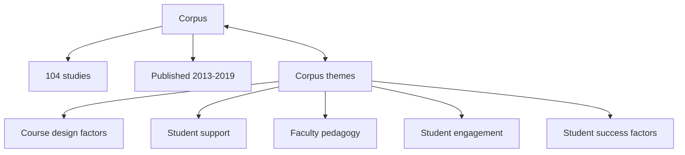

# 2024-09-18: Lockman & Schirmer, 2020

- Discussion leader: Richel
- Date: 2024-09-18
- Paper: Lockman, Alison S., and Barbara R. Schirmer. "Online instruction in higher education: Promising, research-based, and evidence-based practices." Journal of Education and e-Learning Research 7.2 (2020): 130-152. [Download page](https://eric.ed.gov/?id=EJ1258655)

- The goal of this paper is to become a better teacher in online teaching.

## Questions

- The paper reviews the literature from 2013-2019.
  Do you think it is still applicable, or is it outdated?
- Do you believe the main finding of the paper is true?
- Which finding do you think is most relevant for us becoming a better teacher?
- Do you happen to know disagreements with this paper and others?

## Discussion notes

corpus:
- years 2013-2019
- 104 papers

corpus themes:
- course design factors
  - Effective in improving achievement and satisfaction
    - incorporation of multiple pedagogies and learning resources
    - feedback from the instructor and peers
    - user-friendly online tools
    - high instructor presence
    - promotion of socialization
    - group trust 
    - face-to-face teaching (compared to online or hybrid)
  - Less effectivene:
    - groupwork
    - online lectures
- student support
  - important to student achievement in online coursework:
    - orientation to online instruction prior to beginning coursework
    - quality of faculty-student interaction
    - academic support for students
    - establishment of trust and a sense of community
- faculty pedagogy
  - Discussion forums
    - the number of instructor posts influences the number and level of thinking in the student posts
    - discussions were most effective when instructor presence encouraged talk about the students’ personal lives rather than only discussion of factual material and theory
    - the frequency of instructor Interaction did not influence student perceptions of the quality of instruction 
    - the frequency of instructor Interaction did significantly relate to student satisfaction and achievement outcomes
    - a positive association between the number of visual materials accessed and number of discussion posts
    - significant relationship between written assignment scores and attendance at a preparation contact session
    - significant difference between the final exam scores of students who used an online discussion forum and students who did not use this forum
    - the discussion forum promoting greater reflection on course material
    - students posted more messages on Facebook than on the discussion forum
    - discussion forum posts were more task-oriented and Facebook posts were more often off-topic
    - Facebook facilitated social interaction and 
    - the discussion forum facilitated task completion  - Online videos
  - Online videos
    - positive correlations between video usage, ease of use, usefulness, learning performance, and Internet self-efficacy
    - no positive correlations between video usage, ease of use, usefulness, learning performance verus learner satisfaction and learner-learner interaction
    - greater in-class engagement though mixed effects on learning gains, learner attitudes, reflective thinking, self-efficacy, and perceptions of the instructor during supplementary video-based instruction
    - student preference for traditional instruction and low interest in accessing the videos
    - video case studies shown no significant differences in knowledge acquisition
    - engagement with online video cases waxed and waned during the course  - Technologies
  - Social media
    - Significant relationships have been found between student interaction on course Facebook sites, academic performance, and course satisfaction
    - positive correlation between perceived ease of use and intention to use Facebook for learning 
    - no positive correlation between usefulness and intention to use Facebook
    - Facebook facilitated social interaction 
    - Facebook did not facilitate learning academic material
    - students primarily used social network sites to find information, seek opinions, and keep in touch with friends and family
    - they (Bozkurt, Karadeniz, and Kocdar (2017)) expressed the belief that social network sites have potential for education purposes  - Quality of online teaching
  - Technologies
    - synchronous online learning community encouraged active learning, meaningful interactions, and engagement
    - proficiency with e-technologies and student motivation were significantly related to better learning outcomes in web-based synchronous online classes
    - students (!!!) felt (!!!) the smartphones apps had a positive influence on their learning of course content
    - pictorial stories had a positive influence on subject matter understanding, attentiveness, enthusiasm, and participation
    - students differed in their preferences for web-based modules versus traditional instruction- student engagement
  - Qualities of Faculty Online Teaching
    - students valued the feedback from instructors more highly than peer feedback
    - students reported their discomfort with providing critical feedback to peers
    - students rarely disagreed with others in the discussion forum
    - less proficient writers made significant writing improvement whereas proficient writers made relatively slight writing progress
    - the immediacy and usefulness of the feedback had the greatest impact on improvement with similar tasks
    - students who showed high levels of interaction with the feedback made the greatest improvement
    - little direct effect of feedback on student performance
    - high-face threat mitigation enhances the students’ perception of instructor credibility and improved their motivation
    - a significant relationship between perception of instructor presence and course satisfaction 
    - no significant relationship between perception of instructor presence and course outcomes
    - students who perceived higher levels of teaching presence demonstrated higher levels of motivation
    - more that students reacted negatively to instructor feedback, the less motivated they were
    - instructors recognized the need for culturally responsive teaching but their knowledge fell short of addressing this need
    - the groups whose learning partners were recommended completed the problem-solving tasks significantly better than the groups without learning partner recommendations
    - When the online component included notes offering metacognitive support, results showed that the students earned significantly higher scores in forethought, self-regulation, and self-reflection
- student engagement
- student success factors

Effective face-to-face teaching:
- the use of multiple pedagogies and learning resources to address different student learning needs
- high instructor presence
- quality of faculty-student interaction
- academic support outside of class
- promotion of classroom cohesion
- trust

Effective online teaching:
- Same as effective face-to-face teaching
- user-friendly technology tools
- orientation to online instruction
- opportunities for synchronous class sessions
- incorporation of social media

Evidence-based effective:

- only faculty feedback

## References

- `[Deenadayalan et al., 2008]`
  Deenadayalan, Yamini, et al. 
  "How to run an effective journal club: a systematic review." 
  Journal of evaluation in clinical practice 14.5 (2008): 898-911.