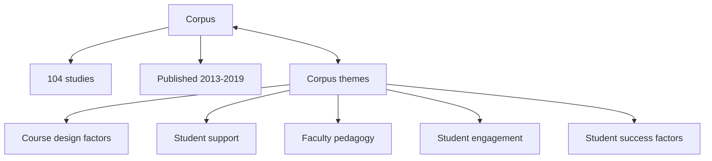

# 2024-09-18: Lockman & Schirmer, 2020

- Discussion leader: Richel
- Date: 2024-09-18
- Paper: Lockman, Alison S., and Barbara R. Schirmer. "Online instruction in higher education: Promising, research-based, and evidence-based practices." Journal of Education and e-Learning Research 7.2 (2020): 130-152. [Download page](https://eric.ed.gov/?id=EJ1258655)

- The goal of this paper is to become a better teacher in online teaching.

## Questions

- The paper reviews the literature from 2013-2019.
  Do you think it is still applicable, or is it outdated?
- Do you believe the main finding of the paper is true?
- Which finding do you think is most relevant for us becoming a better teacher?
- Do you happen to know disagreements with this paper and others?

## Discussion notes

corpus:
- years 2013-2019
- 104 papers

corpus themes:
- course design factors
  - Effective in improving achievement and satisfaction
    - incorporation of multiple pedagogies and learning resources
    - feedback from the instructor and peers
    - user-friendly online tools
    - high instructor presence
    - promotion of socialization
    - group trust 
    - face-to-face teaching (compared to online or hybrid)
  - Less effectivene:
    - groupwork
    - online lectures
- student support
  - important to student achievement in online coursework:
    - orientation to online instruction prior to beginning coursework
    - quality of faculty-student interaction
    - academic support for students
    - establishment of trust and a sense of community
- faculty pedagogy
  - a positive relationship between the number of student posts and course learning
  - mixed results whether the number and quality of instructor posts are related to student participation on discussion forums and course achievement
  - mixed effectiveness from interventions designed to increase student participation in discussion forums – such as incorporation of orientation sessions, visual materials, and social media venues 
  - students expressed a positive attitude toward viewing videos as preparation for in-class sessions and tests
  - no significant correlations between viewing videos as preparation for in-class sessions and tests and learning outcomes
  - viewing videos as preparation for in-class sessions and tests has no effect on course achievement
  - students are inconsistent in accessing videos
  - social media facilitated student-to-student interaction but not academic learning
  - synchronous environments encouraged active learning but required greater student motivation and proficiency with the technology.
  - faculty feedback is more important to students than peer feedback, and timeliness and usefulness are qualities of effective feedback. 
  - Given the student perception that feedback can feel threatening, findings from a few studies indicate that perception of instructor presence can mitigate these feelings and improve student motivation.
  - instructors appreciate the importance of culturally responsive teaching but are not skilled in techniques that incorporate the valuing of diversity among students
  - metacognitive support improves student higher level thinking
  - selection of learning partners in group activities is a factor in student success.
- student engagement
  - greater interaction with online course content is related to better course grades and satisfaction
  - peer and instructor interaction are not consistently related to course satisfaction
- student success factors
  - no correlations were found between student learning style and online course achievement
  - personal self-efficacy and Internet self-efficacy predict online academic achievemen
  - online course achievement is increased by past academic success, motivation, family support, workload management, and digital literacy

Effective face-to-face teaching:
- the use of multiple pedagogies and learning resources to address different student learning needs
- high instructor presence
- quality of faculty-student interaction
- academic support outside of class
- promotion of classroom cohesion
- trust

Effective online teaching:
- Same as effective face-to-face teaching
- user-friendly technology tools
- orientation to online instruction
- opportunities for synchronous class sessions
- incorporation of social media

Evidence-based effective:

- only faculty feedback

## References

- `[Deenadayalan et al., 2008]`
  Deenadayalan, Yamini, et al. 
  "How to run an effective journal club: a systematic review." 
  Journal of evaluation in clinical practice 14.5 (2008): 898-911.