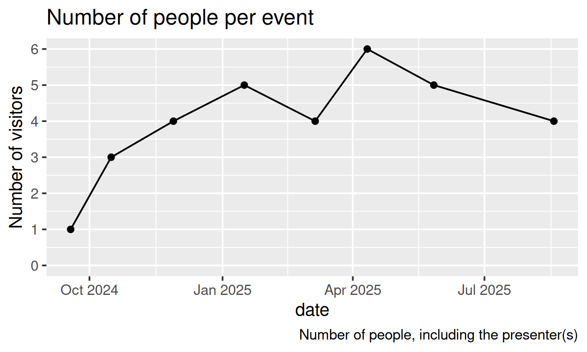

# Data

This is the data collected by the Teaching Literature Club.

## [n_visitors_per_event.csv](n_visitors_per_event.csv)

The number of visitors per event.

Field       |Description
------------|------------------------------------------------------
`date`      |The data in `YYYYMMDD` format
`n_visitors`|The number of visitors. This excludes the presenter(s)

> The number of visitors per event
