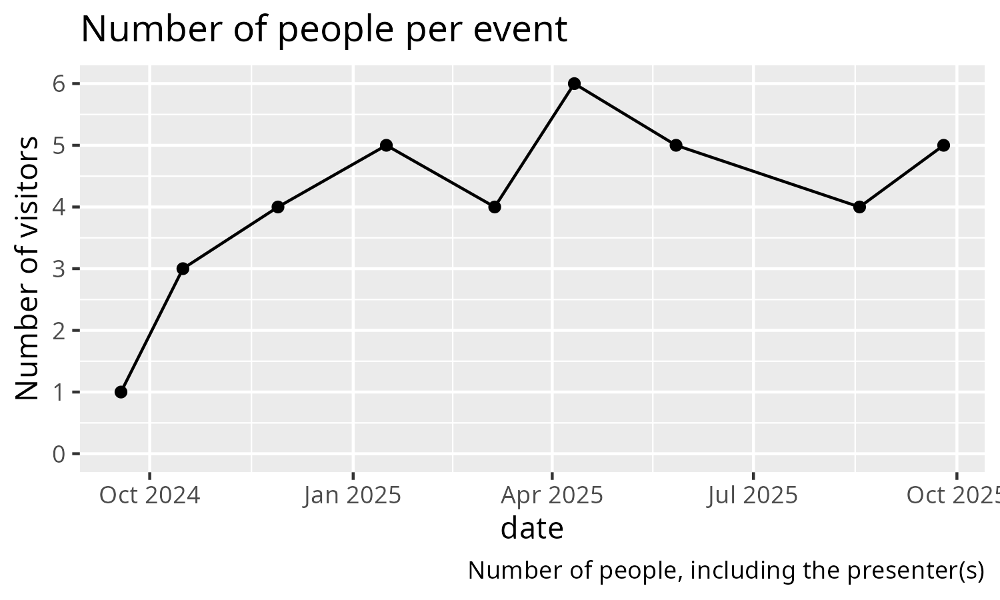

# Data

This is the data collected by the Teaching Literature Club.

## [n_visitors_per_event.csv](data/n_visitors_per_event.csv)

The number of visitors per Teaching Literature Club event.

| Field        | Description                                            |
| ------------ | ------------------------------------------------------ |
| `date`       | The data in `YYYYMMDD` format                          |
| `n_visitors` | The number of visitors. This excludes the presenter(s) |

> The number of visitors per event

## [data_request.csv](data/data_request.csv)

The status of data requests sent to the authors of paper discussed
in the Teaching Literature Club.

| Field          | Description                                              |
| -------------- | -------------------------------------------------------- |
| `request_date` | The date an email request was sent, in `YYYYMMDD` format |
| `status_date`  | The date of the current status , in `YYYYMMDD` format    |
| `status`       | The status of the data request, see values below         |

| `status` value | Description             |
| -------------- | ----------------------- |
| `no_reply`     | No reply to the email   |
| `denied`       | The request was denied, |
| `provided`     | The data was provided   |

> Frequency of data requests

Provided as paradata are the emails to contact an author,
in the form `email_[request_date].txt`. The script `plot_data_requests.R`
checks if all requests have a file with an email text provided.
