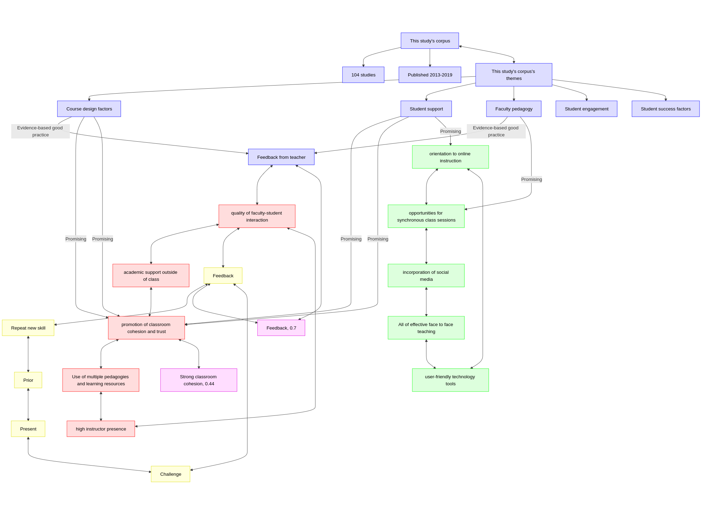

# 2024-09-18: Lockman & Schirmer, 2020

- Discussion leader: Richel
- Date: 2024-09-18
- Paper: Lockman, Alison S., and Barbara R. Schirmer.
  "Online instruction in higher education: Promising, research-based,
  and evidence-based practices."
  Journal of Education and e-Learning Research 7.2 (2020): 130-152.
  [Download page](https://eric.ed.gov/?id=EJ1258655)

## Meeting notes

- Feedback can be left anonymously
  `[link to Google Form]`
  and will be published online publicly
- The person leading the discussion determines how to do that,
  my ideas may not be representative (and that is fine :-) )
- The goal of this journal club is to become a better teacher
- The goal of this paper is to become a better teacher in online teaching
- Procedure
    - Go through questions
    - Any new discussion leader for next month, 16th October?
        - If yes, please share today
    - New paper will be announced Friday
    - Go or stay to evaluate the format of this journal club

## Questions

- What grade on a scale from 1 (worst) to 10 (best) would you give this paper?
- How would you praise the paper?
- How would you criticise the paper?
- How would you summarize the paper in one line?
- The paper reviews the literature from 2013-2019.
  Do you think it is still applicable, or is it outdated?
- Do you believe the main finding of the paper is true?
- Which finding do you think is most relevant for us becoming a better teacher?
- Do you happen to know disagreements with this paper and others?
- How would this paper make us a better teacher?
  (putting in bigger context, as recommended by `[Deenadayalan et al., 2008]`)

## Discussion notes

> This study in context.
> Red nodes: effective teaching according to the literature,
> according to the author.
> Green nodes: effective online teaching according to the literature,
> according to the author.
> Red nodes: this study.

- Yellow: teaching cycle, from `[Bell, 2020]`.

> Purple: influence with effect size, from
> [The Visible Learning website](https://visible-learning.org/hattie-ranking-influences-effect-sizes-learning-achievement/),
> and `[Hattie, 2008]` and `[Hattie, 2023]`.

corpus:

- years 2013-2019
- 104 papers

corpus themes:

- course design factors
    - Effective in improving achievement and satisfaction
        - feedback from instructor
        - incorporation of multiple pedagogies and learning resources
        - feedback from peers
        - user-friendly online tools
        - high instructor presence
        - promotion of socialization
        - group cohesion
        - trust
        - face-to-face teaching (compared to online or hybrid)
    - Less effective:
        - groupwork
        - online lectures
- student support
    - important to student achievement in online coursework:
        - orientation to online instruction prior to beginning coursework
        - quality of faculty-student interaction
        - academic support for students
        - establishment of trust
        - a sense of community
- faculty pedagogy
    - a positive relationship between the number of student posts and
      course learning
    - social media facilitated student-to-student interaction
    - synchronous environments encourages active learning
    - synchronous environments requires greater student motivation
    - synchronous environments requires greater proficiency
      with the technology
    - faculty feedback is more important to students than peer feedback,
      and timeliness and usefulness are qualities of effective feedback.
    - Given the student perception that feedback can feel threatening,
      findings from a few studies indicate that perception of
      instructor presence can mitigate these feelings and
      improve student motivation.
    - metacognitive support improves student higher level thinking
    - selection of learning partners in group activities is a factor
      in student success.
    - mixed results whether the number and quality of instructor posts
      are related to student participation on discussion forums and
      course achievement
    - mixed effectiveness from interventions designed to
      increase student participation in discussion forums – such as
      incorporation of orientation sessions, visual materials,
      and social media venues
    - no significant correlations between viewing videos as preparation
      for in-class sessions and tests and learning outcomes
    - social media does not facilitate academic learning
    - viewing videos as preparation for in-class sessions and tests
      has no effect on course achievement
    - students are inconsistent in accessing videos
- student engagement
    - greater interaction with online course content is related to
      better course grades and satisfaction
    - peer and instructor interaction are not consistently related to
      course satisfaction
- student success factors
    - no correlations were found between student learning style and online
      course achievement
    - personal self-efficacy and internet self-efficacy predict online
      academic achievement
    - online course achievement is increased by past academic success,
      motivation, family support, workload management, and digital literacy

Effective face-to-face teaching:

- the use of multiple pedagogies and learning resources to address different
  student learning needs
- high instructor presence
- quality of faculty-student interaction
- academic support outside of class
- promotion of classroom cohesion
- trust

Effective online teaching:

- Same as effective face-to-face teaching
- user-friendly technology tools
- orientation to online instruction
- opportunities for synchronous class sessions
- incorporation of social media

Evidence-based effective:

- only faculty feedback

## Evaluation

At 9:02, I closed the Zoom room, as there were zero people.
I consider this to be a communication problem
and I have updated the main page.

## References

- `[Bell, 2020]`
  Bell, Mike.
  The fundamentals of teaching:
  A five-step model to put the research evidence into practice.
  Routledge, 2020.
- `[Deenadayalan et al., 2008]`
  Deenadayalan, Yamini, et al.
  "How to run an effective journal club: a systematic review."
  Journal of evaluation in clinical practice 14.5 (2008): 898-911.
- `[Hattie, 2008]` Hattie, John.
  Visible learning:
  A synthesis of over 800 meta-analyses relating to achievement.
  Routledge, 2008.
- `[Hattie, 2023]` Hattie, John.
  Visible learning: The sequel:
  A synthesis of over 2,100 meta-analyses relating to achievement.
  Routledge, 2023.
