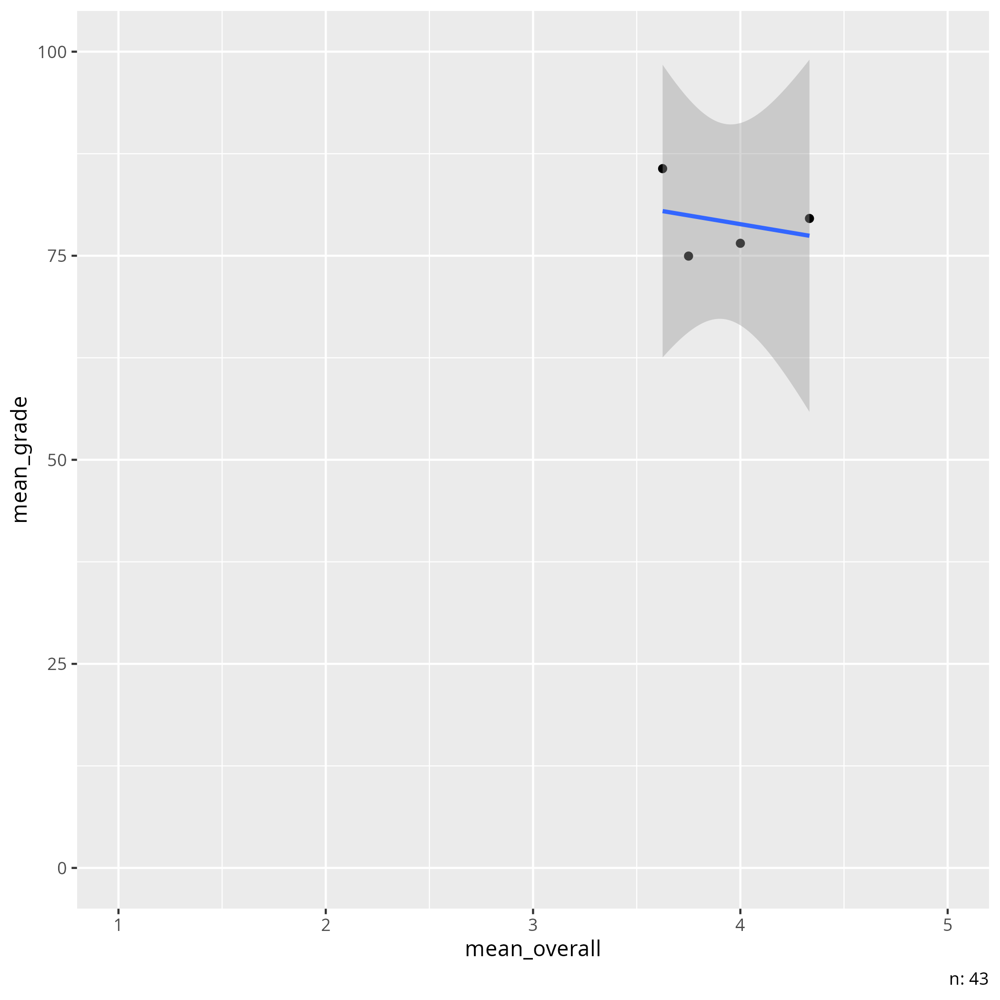

# 2025-01-16

- Discussion leader: Åsa Björklund
- Date: 2025-01-16
- Paper: `[Boring & Ottoboni, 2016]`
  [Download page](https://www.scienceopen.com/document/read?vid=818d8ec0-5908-47d8-86b4-5dc38f04b23e)

## Notes by Richel

My questions:

### How would you summarize the paper?

The paper claims that SET is useless,
as the factors that most influence the grade are not about teacher
quality.

### How would you describe the quality of the paper?

Grade: 4

- Seems to avoid showing some obvious plots
- Code is open
- 0.2% of the data is open: 43 out of (23,001 + 43 = ) 23,043
- Useless without the closed French data
- The results were never interpreted in an obvious English
  fashion

### Does this paper convince you on the uselessness of SET score?

No. It feels more like a p-value hacking expedition.

As a commenter stated: 'There is too much social justice warrior about this article.'

Or, as review Jason Barr writes: 'this study shows gender contributes only
about 1% of the variance in student ratings. Hardly
a “large and statistically significant” amount as stated by the authors'.

### Did you understand the statistics in this paper?

I think I did reasonably well.

### Do you think the statistics in this paper are well-done?

Yes. I see they tested the code for the statistics on
data from MacNeill. A quick glance reveiled
no obvious flaw.
As this in sharp contrast to showing obvious plots,
the paper feels like a p-value hacking expedition.

### Are you convinced of the conclusions of this paper?

No.

The conclusion seems to be that the noise in SET
is influenced more by gender than by other factors.
They never put this result into readable English.
If I do, the conclusion
becomes 'the difference between a bad and good teacher is
less than 1 percent point'.
I feel there is an inherent disconnect between SET and
grades (as I interpreted from `[Clayson, 2009]` and `[Uttl et al., 2017]`)
and this noise has a bigger influence
than gender bias.

## Scribbles by Richel

- p = p value
- p with a flat hat = correlation

Data is a 1-5 scale.
Grade is 100%

SET grades:

```text
   group  professional  respect  caring  enthusiastic  communicate  helpful  \
0      3             5        5       4             4            4        3   
1      3             4        4       4             4            5        5   
2      3             5        5       5             5            5        5   
3      3             5        5       5             5            5        3   
4      3             5        5       5             5            5        5   

   feedback  prompt  consistent  fair  responsive  praised  knowledgeable  \
0         4       4           4     4           4        4              3   
1         5       5           3     4           5        5              5   
2         5       5           5     5           5        5              5   
3         5       5           5     5           3        5              5   
4         5       3           4     5           5        5              5   

   clear  overall  gender   age  tagender  taidgender  
0      5        4       2  1990         0           1  
1      5        4       1  1992         0           1  
2      5        5       2  1991         0           1  
3      5        5       2  1991         0           1  
4      5        5       2  1992         0           1 
```

So, for table 2, we see history has a correlation of 0.16 (and a p value of 0.01)
between SET and grade.
As SET goes from grade 1 to 5, the lowest grade I set to x
and the highest grade is x + (4 * 0.16) = x + 0.64.
Grades are, however, given as a percentage, i.e.
values from 1 to 100.
In this example, the difference between a bad and good teacher is
less than 1 percent point.

Taking a look at the US dataset,
we may feel that it is quite a
small dataset to make such
big conclusions about:



> Correlation between average group grade and average rating of
> the 'overall' trait of the instructor per group.
> Analysis in [analyse.R](analyse.R)

Open questions:

- Can SET be used when the team is only male?
- Can SET be corrected to be fair?

Imagine two learners, one with a bad one with a good teacher.
It is imaginable they get an equally good grade,
if the one with the bad teacher studies by him/herself
longer. It is imaginable that this student rates his/her
bad teacher lower.

Who understood the statistics of this paper?

ScienceOpen.com: what kind of publisher is that?

Other research seems to be ignored,
for example:

This meta-analysis `[Clayson, 2009]`:

> There does appear to be a small average positive asso-
> ciation between learning and the SET in the between-
> class data as measured in these studies. The relationship
> is small, not universal, and subject to the following inter-
> vening variables:
>
> 1. The association is stronger in research published in
> educational journals than in other sources.
> 2. The association is strongest in studies from the
> education and liberal arts disciplines. There is no
> evidence that the association exists in business classes.
> 3. The type of learning measures made a difference.
> The more objective the measures, the smaller the
> learning/SET association.
> 4. The more statistical control was utilized to handle
> extraneous variables in both learning and SET, the
> less association was found. The attenuation of this
> relationship when age of publication was added as a
> covariant suggests simply that researchers are
> becoming increasingly sophisticated over time in
> their utilization of statistical control.
> 5. The findings are highly variable, even for the same
> researcher. Centra’s (1977) correlations ranged
> from .23 to .87. Sullivan and Skanes’ (1974) find-
> ings ranged from −.28 to .55.
> 6. There is no evidence in this sample that a learning/
> SET association exists in within-class data.

Here is meta-analysis `[Uttl et al., 2017]`, that came out after the paper:

> - Students do not learn more from professors with higher
>   student evaluation of teaching (SET) ratings.
> - Previus [sic] meta-analyses of SET/learning correlations
>   in multisection studies are not interprettable.
> - Re-analyses of previous meta-analyses of multisection studies
>   indicate that SET ratings explain at most 1% of variability
>   in measures of student learning.
> - New meta-analyses of multisection studies show that SET ratings
>   are unrelated to student learning.

Also from `[Uttl et al., 2017]`:

> [..] indicate presence of strong
> small study size effects. The small sized studies often reported
> impossibly high voodoo SET/learning correlations whereas the
> large sized studies reported small or no correlations.

And:

> [...] when the analyses include both multisection studies with and without
> prior learning/ability controls, the estimated SET/learning corre-
> lations are very weak with SET ratings accounting for up to 1% of
> variance in learning/achievement measures.

And

> The entire notion that we could measure professors' teaching
> effectiveness by simple ways such as asking students to answer a
> few questions [...] seems unrealistic given well
> established findings from cognitive sciences

And:

> a professor is
> faced with a stark dilemma: teach to the SET and be promoted and
> tenured, or teach to prepare students for the next course,
> graduation and future careers, and be terminated.

These are comments below the paper:

> Emil Ole William Kirkegaard wrote:
>
> I have some comments:
>
> - Use confidence intervals, not p values (cf. 'New Statistics'). 
>   These can be obtained by bootstrapping.
>   If you really want p values, then report both.
> - Put the effect sizes with confidence intervals in the abstract.
> - Alter the empahsis to be more about the lack of correlation between SET and
>   teacher ability. The focus on gender bias is not warranted with the small
>   effect. It is clearly not "large" as claimed. mean r = 0.09 ≈ d 0.20,
>   which by Cohen's standards is small. There is too much social justice
>   warrior about this article.
> - It is possible to adjust for the gender bias by simply adding a little to
>   the females SET multiplied by the proportion of male students.
> - Note which gender was the biased one in the abstract (male against
>   females, not female against males, cf. Table 5).
> - A simpler recommendation is that SETs should not be used at all since they
>   apparently do not correlate with actual performance. Why have them?
>   This side-steps the entire gender bias issue.
> - Add to the abstract that the gender effect could not be explained by male
>   instructors being better (i.e. findings from Table 4).
> - The technical aspect of the analyses seemed fine to me.
>
> Hope these comments are useful. Overall, I liked the article.

From [a review by Jason Barr](https://www.scienceopen.com/document/review?review=43ea6fbc-4fec-4a3f-a19b-8608f4cb7591&vid=818d8ec0-5908-47d8-86b4-5dc38f04b23e):

> So, in the French study we do not know exactly what aspect of teaching
> effectiveness is being correlated with instructor gender.
> In the U.S. study, we know that overall teaching quality is
> NOT associated with instructor gender.

And:

> In studies of ratings of actual teachers there is only a very weak
> relationship that favors female instructors (Centra, 2009; Feldman, 1993)

And:

> this study shows gender contributes only about 1% of the variance in
> student ratings
> Hardly a “large and statistically significant” amount
> as stated by the authors.

Note the short reply by the authors:

> We look forward to additional reviews by people
> who do not have a financial interest in SET.

This is funny, as Boring lists 'Gender economics'
on [her website](http://www.anneboring.com/)
and Stark mentions 'gender bias'
on [his website](https://www.stat.berkeley.edu/~stark/).
They too have a financial interest in finding gender biases :-)

From [a review by Mine Cetinkaya-Rundel](https://www.scienceopen.com/document/review?review=1d3e7568-9805-4fc3-b25b-e57e14431b62&vid=818d8ec0-5908-47d8-86b4-5dc38f04b23e):

> Discussion of effect size and practical significance
>
> The article does not discuss effect sizes and considerations around
> practical significance. This is especially important for the French dataset
> which has a large number of observations. Indeed in Section 6 the authors
> discuss the importance of finding small p-values with the small US dataset,
> however a similar discussion is not included for the French dataset.

## Notes from meeting

- Maybe in natural subjects, the correlation is stronger.

## References

- `[Boring & Ottoboni, 2016]`
  Boring, Anne, and Kellie Ottoboni.
 "Student evaluations of teaching (mostly)
  do not measure teaching effectiveness." ScienceOpen research (2016).
- `[Clayson, 2009]`
  Clayson, Dennis E. "Student evaluations of teaching: Are they related to
  what students learn? A meta-analysis and review of the literature."
  Journal of marketing education 31.1 (2009): 16-30.
- `[Uttl et al., 2017]`
  Uttl, Bob, Carmela A. White, and Daniela Wong Gonzalez.
  "Meta-analysis of faculty's teaching effectiveness: Student evaluation of
  teaching ratings and student learning are not related." Studies in
  Educational Evaluation 54 (2017): 22-42.
