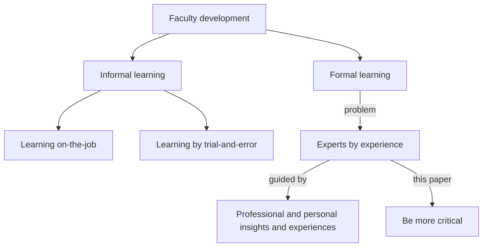

# 2025-04-11

- Date: 2025-04-11
- Lead discussion: Richèl Bilderbeek
- Paper: De Grave, Willem, et al. "Workshops and seminars:
  enhancing effectiveness." Faculty Development in the Health Professions:
  A Focus on Research and Practice (2014): 181-195.
  [website](https://link.springer.com/chapter/10.1007/978-94-007-7612-8_9)

## Questions

- Q: What grade on a scale from 1 (worst) to 10 (best) would you give this paper?

  7.5, as it is a (dull) review, where I feel they oversell
  the workshops that they, the authors, teach, as they provide no data at all.

- Q: How would you praise the paper?

The paper is well-structured.

- Q: How would you criticise the paper?

I am unsure to which extent the whole literature is searched.
The example workshops provide no data, which means I don't believe it.

- Q: How would you summarize the paper in one line?

The effectiveness of workshops and seminars and how to improve that
effectiveness.

- Q: The paper is part of a book 'Faculty Development in the Health
  Professions'. Did you feel that that made the paper less useful?

No, I feel we, teachers that give seminars and workshops,
can learn the same lessons.

- Q: Do we give workshops or seminars? 'When active learning
  methods are utilized in a seminar, the distinction between seminar
  and workshop can easily become blurred.'

I think I give mostly seminars with active teaching methods.

- Q: chapter 9.3: 'Evidence for Effectiveness of Workshops and Seminars'
  states that longitudinal workshops are more effective. Can and should NBIS
  Training Hub do something with this?

I think a yearly teaching event would be fun and useful.

- Q: When preparing something to teach,
  I only schedule cognitive learning activities.
  This paper taught me that there are also affective and
  regulative/metacognitive activities. Who has ever scheduled
  such activities?

Not me :-)

- Q: How would this paper make us a better teacher?
  (putting in bigger context, as recommended by `[Deenadayalan et al., 2008]`)

This paper taught me:

- the difference between a workshop and a seminar:
  I will no be able to use these terms correctly
- that there are (next to cognitive learning activities)
  also affective and regulative/metacognitive activities.
  I will read up more on that,
  as this may be useful.
- the term 'experts by experience'. I will use this as a friendlier
  synonym for my term, which is 'experienced beginner'

## Notes

<!-- markdownlint-disable MD013 --><!-- Mermaid cannot be split up over lines, hence will break 80 characters per line -->



<!-- markdownlint-enable MD013 -->

Asking questions such as the following (Clark 2010; Yardley and Dornan 2012):

- What are the features of this particular method?
- What is the evidence to support its use?
- How valid is this evidence?
- For what purpose, for whom, and when is this method appropriate?
- How does this method or format fit with our understanding of teacher learning?

Definitions:

- Workshops generally have two different emphases: the acquisition of knowledge
  and skills, and the stimulation of changes in attitudes and behavior
  (Brooks-Harris and Stock-Ward 1999; Sork 1984; Steinert et al. 2006).
- Seminars (or short series of seminars) tend to focus on a single, primarily
  cognitive topic, usually aimed at expanding the participants' knowledge base
  (e.g. for education in the health professions)

Steinert et al. (2006) deduced five important characteristics of effective
faculty development workshops:

- the use of experiential learning
- the provision of feedback
- effective peer and colleague relationships
- the application of principles of teaching and learning
- the use of multiple instructional methods
    - ?

Workshops have impacts:

- changing teachers' attitudes, skills and behavior
- can enhance teachers' motivation, self-awareness and enthusiasm

Seminars have a positive impact on, according to first paper:

- awareness of teaching issues
- teaching methods and theory
- motivation and attitude towards teaching
- acquisition of new knowledge about teaching and related skills
- stimulating cooperation between teachers

Seminars have a positive impact on, according to second paper,
most important first:

- the acquisition of new knowledge
- intent to change
- increased awareness of educational topics
- only a few perceived changes in actual teacher behavior

Positive outcomes of seminars is explained by:

- interactivity and the quality of the interaction in small groups
- the use of multiple methods of small group learning
- the limited number of participants and stability of the group composition
- the focus on cases and the application of the acquired knowledge
- the role of the facilitator and adequate preparation for the seminar
- the scheduling of sufficient time between meetings (Davis and Davis 2010;
  Spruijt et al. 2012)

Problem: The learning processes of teachers are
rarely described, even though the success or failure of educational innovations
relies heavily on their efforts.

Solution: We recommend two ways to improve the effectiveness of workshops
and seminars:

- to describe the activities in detail,
  in relation to their learning objectives and design
- to ground faculty development activities
  in a theoretical framework of teacher learning

### 9.4 New framework

'Congruence and friction between learning and teaching' by
Jan D Vermunt, Nico Verloop tries to get more interaction between theory of
learning and theory of teaching.

- Q: 'The design of faculty development activities
  should begin with defining the learning objectives (i.e. what is to be
  learned)'. Who already does that?

The framework consists of three main elements:

- (1) learning outcomes;
    - cognitive 1: changes in knowledge and beliefs
    (awareness, confirmed or new ideas)
    - cognitive 2: intent to practice
    (to try or continue to use new practices, or to continue using
    current practices)
    - behavioral: changes in skills and behavior
- (2) learning activities;
    - (1) cognitive learning activities: those mental activities that learners
    use to process information, leading to changes in knowledge and beliefs,
    (e.g. by relating or structuring information)
    - (2) affective learning activities: e.g. focusing attention, self-motivation
    and coping with feelings of uncertainty, boredom or distraction.
    - (3) regulative or metacognitive activities: monitor, adjust and evaluate
    their cognitive and affective learning activities
- (3) instructional methods to elicit specific learning activities.

The challenge for the designers and facilitators is to create:

- a safe atmosphere and environment that sufficiently resembles
  the work situation of all participants
- defining clear objectives
- providing relevant content
- giving feedback

## 9.5.1

> Usually, the participants report that they are more motivated to learn
> after having formulated their own learning needs and goals,
> even if their attendance at the workshop was compulsory.

How much? No data here: could be a significant irrelevant difference
or a non-significant relevant

Actually, this whole chapter shows no data.
This means I do not believe it.

Also, this workshop seems to have stopped.
Related workshops, e.g.
<https://www.erasmusmc.nl/nl-nl/onderwijs/opleidingen/teach_the_teacher_iii>
show no data either.

## 9.5.2

No data, no believing.

## Extract the paper

```bash
pdftk 978-94-007-7612-8.pdf cat 193-207 output de_grave_et_al_2014.pdf
```
