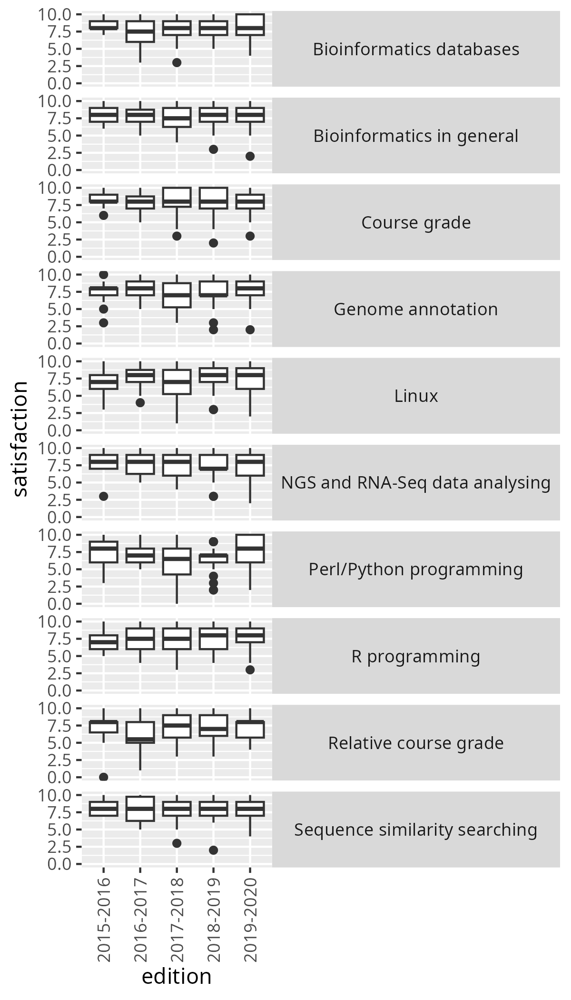
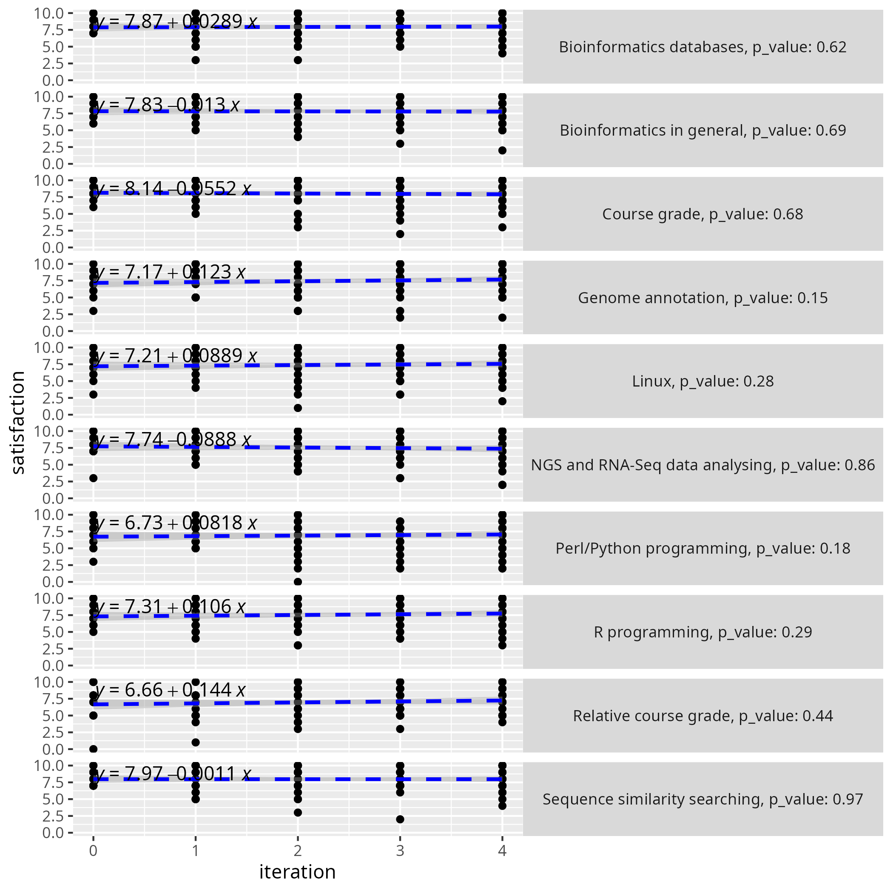

# 2025-05-25

- Date: 2025-05-25
- Lead discussion: Elin Kronander
- Paper: Andrés Garzón et al.
  E-learning strategies from a bioinformatics postgraduate programme
  to improve student engagement and completion rate,
  Bioinformatics Advances (2022)
  [`https://doi.org/10.1093/bioadv/vbac031`](https://doi.org/10.1093/bioadv/vbac031)

## Notes

### Questions

- Q: What grade on a scale from 1 (worst) to 10 (best)
  would you give this paper?

4.0, as I do enjoy the ambitions of the authors,
but they only deliver parts of
the data and oversell the results.

- Q: How would you praise the paper?

It seems to be written by teachers that seem ambitious,
strive to follow evidence-based best practices
and know part of the literature.

- Q: How would you criticise the paper?

- The title is false: 'E-learning strategies from a bioinformatics
  postgraduate programme to improve student engagement' should be called
  'A bioinformatics postgraduate programme that has reduced its dropout rate'
- The data and code are only supplied partially
- No statistics, but do explain results on eyeballing and
  wishful thinking
- They could have read that there is no relation
  between teaching ratings and student learning `[Uttl et al., 2017]`.
- They write 'we show' without showing it at all

- Q: How would you summarize the paper in one line?

Ambitious teachers overselling a course that has reduced its dropout
rate for an unknown reason.

- Q: How would you explain the reduced dropout rate?

It is not an increase in course satisfaction, as there is none.

They state that:

> We showed that
> the differentiation of teaching roles, including mentors that monitor
> small groups and provide rapid-response support to students, can
> make a major contribution to improving the performance of individ-
> ual learners. The intended outcome of this mentoring strategy is to
> reduce the impact of any negative critical incidents on the students’
> perception, which has been pointed as a major factor in student
> dropout (Lin, 2011)

However, they do not show it. Figure 4b, panel 4.1 'The importance
of the tutor's contribution' shows:

- no clear increase at all
- is from the teacher's perspective: the students have never
  been asked.
- the data is absent to check
- there is no statistics.
- few teachers filling in the survey

I do assume the literature is right, they just don't show it.

- Q: How would this paper make us a better teacher?
  (putting in bigger context, as recommended by `[Deenadayalan et al., 2008]`)

This paper taught me:

- How it looks like when authors struggle to get their paper published
- A paper to read, that may show that negative critical incidents
  are a major factor in student
  dropout (Lin, 2011)

### Course history

- The course still exists at
  [the course website](https://www.upo.es/formacionpermanente/diploma-especializacion/analisis-bioinformatico/)
- Costs nowadays: 855 euros per year. However,
  there are also these costs (from
  [the course website, section 'Pagos'](https://www.upo.es/formacionpermanente/diploma-especializacion/analisis-bioinformatico/)):
    - Reservation fee: 128.25 euros
    - Registration fee (once admission is notified and before the program
      begins): 363.38 euros
    - First installment payment (January 2026): 363.37 euros

### My opinion

- They claim they share all data, but they do not
- They do not share their analysis code
- Figure 2c, showing dropout and yield rate is the most promising
  result. However, its last year shaped by the corona pandemic.
  Ignoring the last value still shows a promising trend.
- There is no data to statistically show that the course grades have improved
- There is no evidence that satisfaction has changed in any way

They measure the course satisfaction of the learners.
We know from meta-analyses that there is no relation
between teaching ratings and student learning `[Uttl et al., 2017]`.
I wonder how they explain the change (if any) of the values?

Why do they keep track of countries and regions?

`suppl6.xlsx` shows that there are 127 learners
over 5 years = ~25 learners per year

> (more than 30 students on average; see Fig. 3a for details)

From `suppl5.xlsx`:

Year     |Number of registrations
---------|-----------------------
2015-2016|59
2016-2017|53
2017-2018|60
2018-2019|62
2019-2020|78

From `suppl6.xlsx`:

Year|Number of evaluations|Percentage evaluations per registration
---------|---|---------
2015-2016|16 |16/59=27%
2016-2017|18 |18/53=34%
2017-2018|22 |22/60=37%
2018-2019|33 |33/62=53%
2019-2020|37 |37/78=47%

## Grades

I think this is what it is about.

Starting year|Average grade
-------------|-------------
2015         |7.4
2016         |7.6
2017         |?
2018         |8.1
2019         |7.95

In figure 2d, what was the average final grade for the green/2017-2018 cohort?

From figure 2e, I see no reason to believe that the average grade
has changed. I cannot check, as this data has not been published.

Why not publish the grades?

The data is incomplete.

> The results for subjects related to programming languages,
> two of the most challenging subjects for students with a scientific profile,
> present a generally upward trend (Fig. 3b).

Well:

- There is not much data to work on
- By eyeballing, in PRG, 1.2 and 1.3 have an upward trend.
  For R, this trend is not as clear
- For other subjects, there is no trend at all
- The data uses a scale from 1-10, where this is plotted from 1-5. Why?

## Fig 4a, section 4.3: student course satisfaction

In section '4.3 Students' and teachers' overall course satisfaction
help to progressively improve the programme':
the problem with this title is that
there is no change in any satisfaction over the years,
except when I combine the satisfactions of the courses:

course                         | p_value|is_changing
-------------------------------|--------|------------
Course grade                   |   0.684|FALSE
Relative course grade          |   0.438|FALSE
Sequence similarity searching  |   0.974|FALSE
Bioinformatics databases       |   0.615|FALSE
Linux                          |   0.277|FALSE
R programming                  |   0.289|FALSE
Perl/Python programming        |   0.176|FALSE
NGS and RNA-Seq data analysing |   0.857|FALSE
Genome annotation              |   0.154|FALSE
Bioinformatics in general      |   0.688|FALSE
Courses combined               |   0.036|TRUE

This means that this statement is nonsense:

> the scores show a positive trend over the successive course editions,
> which could be related to both the faculty’s accumulated experience,
> and the students’ higher profiles.

Also, note the survivorship bias here:

> The average mark given by the students for the course as a whole
> has always been above 8 out of 10 and is currently close to 9.

## As quoted by others

From [Wolff, Katharina, et al. "Data literacy in genome research." Journal
of Integrative Bioinformatics 20.4 (2024): 20230033]:

- Previous publications also reported success with transdisciplinary
  approaches used for diverse cohorts [xx, xx]
  and the particular importance of a practical methodology and problem-based
  learning approaches [25].

This paper did not prove the particular importance of a practical
methodology and problem-based learning approaches...?

From [Minga Vallejo, Ruth Elizabeth. "Construcción social de aprendizajes
a través de MOOCS para la sustentabilidad energética como espacios para
la innovación abierta y colaborativa." (2024)]:

> 26 used a quantitative method, such as [x], [x], [x].
> 10 used a mixed method, such as [x], [x], [69]

Ah, they used a mixed method ...?

The second and last mention of the same study:

> Of the 70 articles identified in Scopus and Wos,
> 50 used the qualitative method, some examples are articles with
> identification numbers [x], [x], [x];
> 25 of these articles used a phenomenological design,
> some examples are studies [x], [x], [69]

I assume this a mistranslation: using a 'phenomenological design'
is new to me ...?

## Misc

> In addition, students’ perceptions must be considered
> with caution (Islam, 2013).
> It was shown, for example, that both teachers and students resisted active
> teaching strategies and preferred traditional methods,
> despite better results in acquired competencies (Deslauriers et al., 2019).

Fun!

## References

- `[Uttl et al., 2017]` Uttl, Bob, Carmela A. White, and Daniela Wong Gonzalez.
  "Meta-analysis of faculty's teaching effectiveness:
  Student evaluation of teaching ratings and student learning are not related."
  Studies in Educational Evaluation 54 (2017): 22-42.
