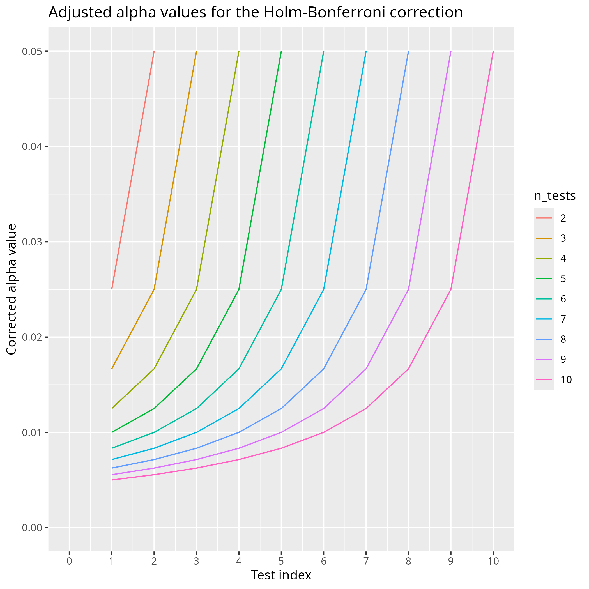
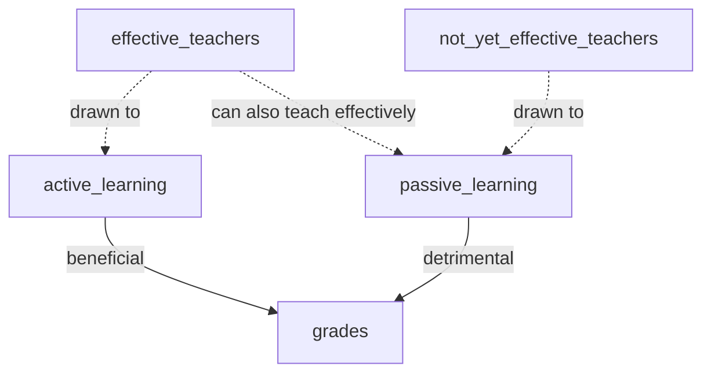

---
tags:
  - notes
  - 2025-09-25
  - McClellan
---

# 2025-96-25

- Date: 2025-09-25
- Lead discussion: Elena Dracheva
- Paper: 'McGreevy, Kristen M., and Frank C. Church.
  "Active learning: Subtypes, intra-exam comparison,
  and student survey in an undergraduate biology course."
  Education Sciences 10.7 (2020): 185.
  [`https://www.mdpi.com/2227-7102/10/7/185`](https://www.mdpi.com/2227-7102/10/7/185)
  [`mcgreevy_and_church_2020.pdf`](../papers/mcgreevy_and_church_2020.pdf]

## Notes

### Questions


- Q: What grade on a scale from 1 (worst) to 10 (best)
  would you give this paper?

???- question "My answer"

    5

- Q: How would you praise the paper?

???- question "My answer"

    - I like the second author, Church: he seems to really care
      about his students: he organizes dinners and shared
      [his blog about his Parkinson](https://journeywithparkinsons.com/)
      openly
    - I like the hierarchy they propose in section 3.1

- Q: How would you criticise the paper?

???- question "My answer"

    - It is not mentioned how to obtain the data
    - The claim that students prefer lectures is misleading

- Q: How would you summarize the paper in one line?

???- question "My answer"

    - 'Students study'
    - 'Engaged teachers trying to sell a paper with null findings'
    - 'Engaged teachers can teach effectively with any setup'

- Q: Should we do what is in the paper?

???- question "My answer"

    Consider using the hierarchy in section 3.1.

    Ignore

- Q: How does this paper make us a better teacher?

???- question "My answer"

    It shows me that being able to do active learning
    also makes one better at lecturing.

## Scribbles


## My questions

## Introduction: False statement about what students prefer

> However, students are still convinced they learn more from a traditional
> lecture than from an active learning experience [25]

I've checked that paper, `[Joel, 2006]`, and no students were asked for their
opinion. It is a teacher that is sharing his views on students.
Also both papers referred to are about a teacher (`[Volpe, 1984]`)
or teachers (`[Halpern and Hakel, 2002]`) sharing their view about
student. In all papers, there are no students
being surveyed for their opinion!

Searching Google Scholar for 'student perception of active learning'
and investigating the first 3 hits.

- `[Lumpkin & Achen, 2015]`: students prefer active learning:
  'Quantitative and qualitative data revealed students valued participating
  in engaging learning activities.
  Students also affirmed how active engagement positively impacted
  their learning.'

- `[Smith and Cardaciotto, 2011]` Active learning gives 6% higher grades.
  Passive learning gives `(3.6 - 3.37) / 3.37 =` 7% more enjoyment.
  Course evaluation is `(3.3 - 3.11) / 3.11 =` 6% higher for passive learning.

```text
Topic,M_active,SD_active,M_passive,SD_passive,F,d
Research Methods,2.97,0.97,2.74,0.99,10.64***,0.23,
Brain and Behavior,3.09,1.02,3.15,1.01,0.63,
Sensation and Perception,3.03,0.96,2.87,1.01,6.26**,0.06,
Learning,3.14,1.00,3.07,1.02,1.35,
Memory,3.32,1.04,2.98,1.00,25.43***,0.33,
Intelligence,3.06,0.98,2.92,1.00,4.53*,0.14,
Emotion,3.07,1.04,2.89,0.97,6.38**,0.18,
Social Psychology,3.02,1.02,2.85,0.97,6.04**,0.17,
Abnormal Psychology,3.19,1.02,2.92,1.02,14.48***,0.27
```

> Grades of students, from `[Smith and Cardaciotto, 2011]`

- `[Machemer and Crawford, 2007]` found
  'The study found that students valued lectures and being active.
  From the students' perspective, however,
  working with others (cooperative learning) diminishes the value significantly.
  Any activity, be it active, cooperative or traditional,
  that directly relates to improving exam performance
  was the most valued of all.'
  That is, lectures are valued `(4.125 - 4.1026) / 4.1026 =` 0.5% more
  Cooperation was valued `(3.479075 - 4.1026) / 4.1026 =` 15% less than
  active teaching.


```text
2002,Coop_overall,3.3000,112,0.81914,0.07740
2002,Active_overall,3.9286,112,0.74995,0.07086
2002,Traditional_overall,3.68,112,0.988,0.093
2003,Coop_overall,3.1433,109,0.80282,0.07690
2003,Active_overall,4.0046,109,0.72487,0.06943
2003,Traditional_overall,3.92,109,0.992,0.095
2004,Coop_overall,3.7365,44,0.72701,0.10960
2004,Active_overall,4.2386,44,0.59542,0.08976
2004,Traditional_overall,4.45,44,0.627,0.095
2005,Coop_overall,3.7365,44,0.72701,0.10960
2005,Active_overall,4.2386,44,0.59542,0.08976
2005,Traditional_overall,4.45,44,0.627,0.095
```

Putting this little literature search in a table:

Reference                      |What do students prefer|Extent
-------------------------------|-----------------------|------------------------
`[Joel, 2006]`                 |Not mentioned          |Not mentioned
`[Volpe, 1984]`                |Not mentioned          |Not mentioned
`[Halpern and Hakel, 2002]`    |Not mentioned          |Not mentioned
`[Lumpkin & Achen, 2015]`      |Active learning        |Not mentioned
`[Smith and Cardaciotto, 2011]`|Passive learning       |6% higher value
`[Machemer and Crawford, 2007]`|Passive learning       |0.5% higher value

Are students really 'still convinced they learn more from a traditional
lecture than from an active learning experience'?

## 2.2. Question selection

From 2.2. Exam Information:

> Only the multiple choice, matching, and true–false response sections
> for each exam were used in the analyses.

Why? What is the impact?
What do you think the reason is?

## Table 2

I like the setup of the experiment.

I wish the number of students taking each exam was mentioned:
all/most will do exam 1, fewer exam 2 and even fewer exam 3,
as can be inferred from figure 3.

## 2.5 Dwass–Steel–Critchlow–Fligner test

In section 2.5, we read about the use of the
Dwass–Steel–Critchlow–Fligner test.

A quick search finds me the
[`DSCFTest` as part of the `Analitica` package](https://rdrr.io/cran/Analitica/man/DSCFTest.html).
Fun fact: the return values are in Spanish :-) . The author
keeps the versions [https://github.com/cjimenezgallardo/analitica](https://github.com/cjimenezgallardo/analitica).
The package has 1 test: to check if a function returns a structure
with the element `Mean`.

A second hit takes me [`pSDCFlig` as part of the `NSM3` package](https://rdrr.io/cran/NSM3/man/pSDCFlig.html),
which is an R package inspired on a statistics book.
This package, which can be found at
[https://github.com/grantschneider/NSM3](https://github.com/grantschneider/NSM3)
has no tests whatsoever, although that
[is a work in progress](https://github.com/grantschneider/NSM3/issues/4).

Without any data, and given that the test is obscure,
and given two out of two implementations are only informally tested,
how certain can you be of its findings?

## 2.8

I think the Holm–Bonferroni procedure is quite interesting.

- [`holm_bonferroni.R`](holm_bonferroni.R)



## 3.1. Active Learning Subtypes

Sure, I believe you...
I am unsure how scientific this is though ...

## 3.2 Active Learning Subtype Evaluation Results

### 3.2a. Relevant improvement?

Taking a look at the improvement over lecturing,
do we think this is a relevant improvement?

Level    |Mean score|Improvement over lecturing
---------|----------|-------------------------------
Lecturing|89.3      |`(89.3 - 89.3) / 89.3 =` +0%
R        |87.6      |`(87.6 - 89.3) / 89.3 =` -2%
E        |93.8      |`(93.8 - 89.3) / 89.3 =` +5%
C        |86.2      |`(86.2 - 89.3) / 89.3 =` -3%
F        |91.8      |`(91.8 - 89.3) / 89.3 =` +3%
A        |88.7      |`(88.7 - 89.3) / 89.3 =` -1%
RECFA    |89.62     |`(89.62 - 89.3) / 89.3 =` +0.3%

### 3.2b. Do students study?

I would say that 0.3% difference in grades, when comparing passive versus
active learning, means no relevant difference in
course grades. This is interesting as the effect size of lecturing
is -0.26. Any other form is more effective, e.g. Direct Instruction (0.56),
Problem-based learning (0.45), Problem-solving teaching (0.61),
Flipped classroom (0.56). A classroom discussion is one of the
most efficient way to improve understanding (0.82).

To explain this lack of a difference: maybe students studied?

### 3.2c. Do effective teachers do passive teaching more effective?

I would say that 0.3% difference in grades, when comparing passive versus
active learning, means no relevant difference in
course grades. This is interesting as the effect sizes are
very different. One mechanism to reconcile the findings with the theory
is to assume that the more efficient teachers are drawn to active
teaching (i.e. the authors),
yet are able to teach effectively too using passive learning.
What do we think about this theory?
  



Note that they mention this in the Discussion themselves too:

> Does an instructor who uses active learning not only improve
> comprehension on the material taught with active learning
> but also improve comprehension on material
> taught through lecture learning?

## 3.4

> student responses from survey statement three show most students
> think they learn better
> by lectures than active learning regardless of year or honors,
> which confirms previous research [25].

Again, this is false, as shown in the introduction.

## 3.4 Are students relevantly more favoring active learning?

In table 6, we see an increase in students in favor of active learning.
Comparing the lowest value (Fall 2012, 4.57) to the highest value (Fall 2015, 4.85)
we can conclude an increase of
`(4.85 - 4.57) / 4.85 =` 6%.
Is this a relevant difference?

## 4. Discussion

> We recommend that teachers (1) use online break-out
> rooms, but keep the same students in each group;
> (2) alternatively, the students were also asked
> to meet on their own time as groups using Zoom, and
> (3) we recommend that teachers remind the
> students to turn on their sound and videos in these groups.
> The students formed collegial bonds and
> re-established team-building relations during the pressing times.
> It was clear that most of the students
> reacted positively to re-joining their groups.

This is my favorite part, only because I have the same ideas.
However, as this is anecdotal, it is useless to me.

## Next paper?

What I find most interesting is that the teachers did effective lecturing.

I would enjoy to look for a paper in which ways a lecture can be made
effective.

## References

- `[1]` See `[Hattie, 2023]`, page 363, effect size is -0.26 with a robustness
  index of 4 out of 5
  and is based on 3 meta analyses using 273 studies using 27,296 people,
  measuring for 614 effects with a standard error of 0.08.
  One example open access study is `[Knight & Wood, 2005]`.
- `[Hattie, 2012]` Hattie, John. Visible learning for teachers:
  Maximizing impact on learning. Routledge, 2012.
- `[Hattie, 2023]` Hattie, John. Visible learning:
  The sequel: A synthesis of over 2,100 meta-analyses relating to achievement.
  Routledge, 2023.
- `[Knight & Wood, 2005]` Knight, Jennifer K., and William B. Wood.
  "Teaching more by lecturing less." Cell biology education 4.4 (2005): 298-310.
  [paper](https://www.lifescied.org/doi/full/10.1187/05-06-0082)
- `[Volpe, 1984]`
  Volpe, E. Peter. "The shame of science education."
  American Zoologist (1984): 433-441.
- `[Lumpkin & Achen, 2015]` Lumpkin, Angela, Rebecca M. Achen,
  and Regan K. Dodd. "Student perceptions of active learning."
  College Student Journal 49.1 (2015): 121-133.
- `[Smith and Cardaciotto, 2011]` Smith, C. Veronica, and LeeAnn Cardaciotto.
  "Is active learning like broccoli? Student perceptions of active learning
  in large lecture classes."
  Journal of the Scholarship of Teaching and Learning 11.1 (2011): 53-61.
- `[Machemer and Crawford, 2007]` Machemer, Patricia L., and Pat Crawford.
  "Student perceptions of active learning in a large cross-disciplinary
  classroom." Active learning in higher education 8.1 (2007): 9-30.
- `[Joel, 2006]` Michael, Joel.
  "Where's the evidence that active learning works?."
  Advances in physiology education (2006).
- `[Halpern and Hakel, 2002]` Halpern, Diane F., and Milton D. Hakel.
  "Learning that lasts a lifetime: teaching for long‐term retention
  and transfer." New Directions for Teaching and Learning 2002.89 (2002): 3-7.
