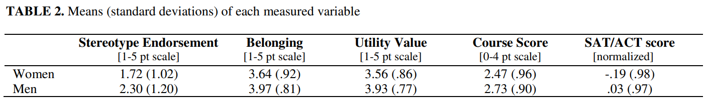
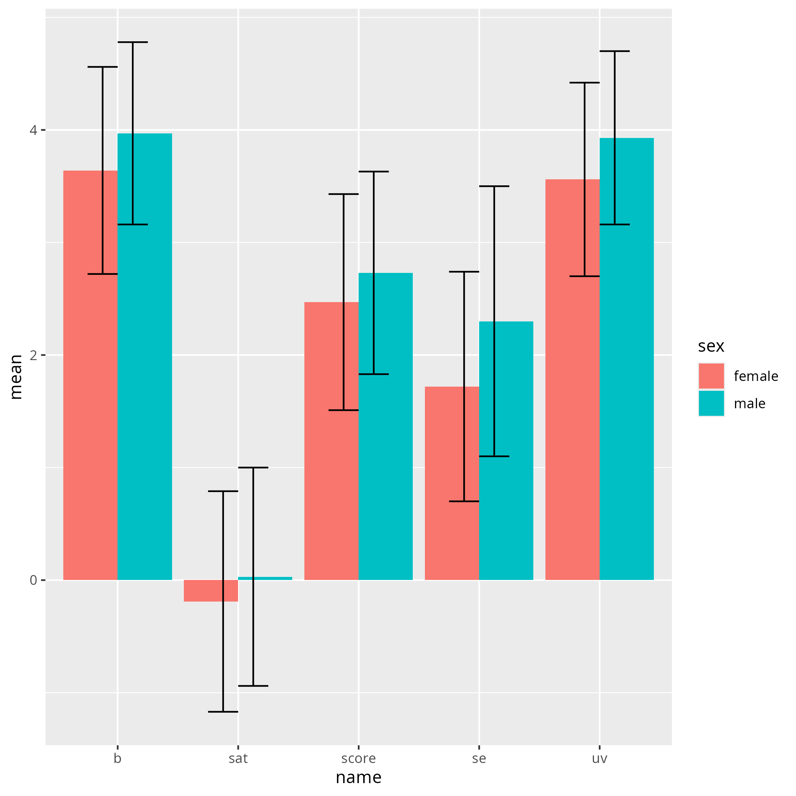
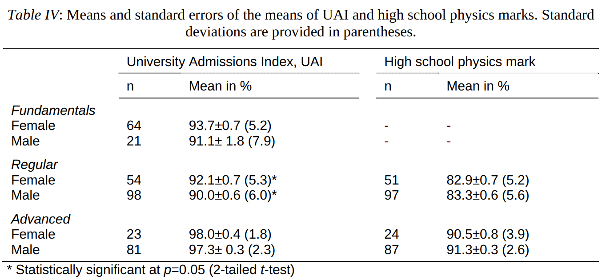

---
tags:
  - notes
  - 2025-10-30
  - Angela Johnson
  - How to design research-aligned DEI interventions in physics
---

# 2025-10-30

- Date: 2025-10-30
- Lead discussion: Kristen Schröder
- Paper: Johnson, Angela.
  "How to design research-aligned DEI interventions in physics."
  arXiv preprint arXiv:2406.01390 (2024)
  [`https://arxiv.org/abs/2406.01390`](https://arxiv.org/abs/2406.01390)

## Notes

### Questions

- Q: What grade on a scale from 1 (worst) to 10 (best)
  would you give this paper?

???- question "My answer"

    2

???- question "Answers from the group"

    These are the answers from the group, which
    includes me.

    8, 8, 10, 2, 3

Answer:

- Q: How would you praise the paper?

???- question "My answer"

    I am happy the author seems to care about minorities
    and tries to recommend an evidence-based approach.

- Q: How would you criticise the paper?

???- question "My answer"

    I am sorry for all people that care about DEI
    that misleading papers such as this one exist.
    It makes people honestly researching DEI look needlessly stupid.
    I feel the same of two out of two papers I've taken
    a closer look at, which are `[Hazari et al., 2013]` (`[42]` in this paper)
    and `[Stout et al., 2013]` (`[44]` in this
    paper).

- Q: How would you summarize the paper in one line?

???- question "My answer"

    DEI research is not to be trusted.

- Q: Should we do what is in the paper?

???- question "My answer"

    Absolutely not

- Q: How does this paper make us a better teacher?

???- question "My answer"

    - It shows me again that we should never trust a paper at face value
    - DEI interventions have no effect `[Hazari et al., 2013][42]`,
      however, that paper presents a wrong analysis
      that makes it appear they do
    - There is no relevant gender gap in physicals: the variation between
      the two genders is much bigger than the difference in mean:
      we should focus on improving the measured variables for everyone,
      instead of for one gender. Also here, this conclusion is
      drawn from `[44][Stout et al, 2013]`, however, that paper misinterprets
      its data

## My questions

- Equity: equal opportunities, e.g. providing hearing aids for the deaf.

## Extent of the problem

I hope this paper will show how big the problem is that is solved.

The paper seems ambitious by also stating that it looks for
evidence.

## How do the listed DEI interventions improve DEI?

???- question "What are these 4 DEI interventions?"

    - Light touch DEI intervention
    - DEI training: workshops
    - DEI unit
    - DEI semester-long theme

Here is my initial guess:

<!-- markdownlint-disable MD013 --><!-- Tables cannot be split up over lines, hence will break 80 characters per line -->

Intervention                |Effect of diversity?|Effect on equity?|Effect on inclusion?
----------------------------|--------------------|-----------------|--------------------
Light touch DEI intervention|?No                 |?No              |?Yes, but weird
DEI training: workshops     |?No                 |?No              |?No
DEI unit                    |?No                 |?No              |?No
DEI semester-long theme     |?No                 |?No              |?No

<!-- markdownlint-enable MD013 -->

## 4. Outcomes

- A. Reduce implicit bias
- B. Increase participants' awareness of their
  own biases/the impact of bias on others
- C. Teach participants strategies to overcome bias
- D. Increase opportunities to practice strategies to overcome bias
- E. Increase internal or external motivation to reduce bias
- F. Increase physics identity/intent to pursue a physic major or career
- G. Increase the sense of belonging/decrease the sense of isolation
  of physics students who are members of minoritized groups

I think F is most important for this paper. I hope to read a number
about this. However, when I analysed the author adressing this,
I am convinced that the outcome is that there is no difference, i.e.
each of the DEI interventions have had no relevant outcome.

With F concluded to be irrelevant, I am most interested in G.
Let's take a look at that.

## 4.A Implicit bias

> A. Reduce implicit bias
> While some interventions have been shown to reduce participants'
> implicit biases (as measured
> on the Implicit Association Test, for example), these changes do not lead
> to changes in either explicit bias
> or behavior. Thus, I do not recommend reduction of implicit bias
> as an outcome goal unless it is
> accompanied with other goals; perhaps not even then,
> as it is not clear that implicit bias is in fact a
> measure of participants' animus to other groups.
> There is reason to think it might be a measure instead of
> the cultural norms of their environment.

I think this is a good idea, to not care about implicit bias tests:
out of curiosity, I've taken one. This is my result:

> You were slightly faster at sorting 'Fat people' with 'Bad words'
> and 'Thin people' with 'Good words'
> than 'Thin people' with 'Bad words' and 'Fat people' with 'Good words'

This results does not give me any info. I felt the test was rigged.

## 4.F. Increase physics identity/intent to pursue a physic major or career

The paper refers to `[Hazari et al., 2013][42]`,
where they analyses the effect of these DEI interventions:

- (i) having a single-sex physics class
- (ii) having female scientist guest speakers,
- (iii) having a female physics teacher,
- (iv) discussing the work of female scientists
- (v) discussing the underrepresentation of women

Table 1 from `[Hazari et al., 2013][42]` contains the results.

???- question "How does that table look like?"

    

As the data was not available ( :-/ ), I created
[a comma-seperated](hazari_et_al_2013_table_1.csv) from it manually.
I am happy the values for the control group before and after the
experiment were reported: the world may change during the experiment.

I decided to take a look at the results visually, following the
line of reasoning of the paper:

I also wanted to see the improvements, similar to the paper,
using `(new - old) / old = (treatment - control) / control =`,
resulting in the same reported values:

However, one thing that was weird to me, is that they compare groups taken at
different points in time: the treatment group was measured after the
treatment, where the control group used was the one before the treatment.

I decided to compare with the control group after the treatment:

Here I see no difference. Let's plot the differences:

I conclude that `[Hazari et al., 2013][42]` is misleading
and proves that there is no relevant effect.

Back to the original paper, its author writes:

> First, it is indeed possible to increase girls' and women's interest
> in physics, and
> second, several of the common-sense ways people hope to do this are not
> well-supported by research;

I conclude that the author is successfully mislead.

<!-- markdownlint-disable MD013 --><!-- Headings cannot be split up over lines, hence will break 80 characters per line -->

## 4.G. Increase the sense of belonging/decrease the sense of isolation of physics students who are members of minoritized groups

<!-- markdownlint-enable MD013 -->

Here no qualitative research regarding physics is supplied.

Let's take a look at the author's more general statements,
that should convince me of the importance of belonging:

> This outcome is particularly salient to physics communities,
> as there is evidence that
>
> 1) a sense of belonging is associated with success
> in STEM `[43, Good, 2012, #903]`
> and physics `[44, 45]`, and
> 2) members of minoritized groups often experience
> a lower sense of belonging
> than other students in STEM `[46, Good, 2012 #903]` and
> physics `[8, 44, 47-49]`.
> There is also evidence that women of color in physics
> sometimes experience intense isolation `[50, 51.]`

I think point 2 is is uninteresting: I am unsurprised any minority group
has a lower sense of belonging. Question is: do these feelings have an effect?
I will take a look at paper `[44][Stout et al, 2013]`
to see how much this influences success.

The author of this paper claims 'a sense of belonging is associated with
success in physics'.
The title of `[44][Stout et al, 2013]` ('How a gender gap in belonging
contributes to the gender gap in physics participation') is about participation.
Let's see how we can unite these different words.

The numbers we need are in `[44][Stout et al, 2013]` table 2.

???- question "How does that table look like?"

    

When I convert these number to
[a comma-seperated file](stout_et_al_2013_table_2.csv)
by hand, I see this:

> Visualization of `[44][Stout et al, 2013]` table 2,
> with the abbreviations below. Error bars show the standard deviation.

Abbreviation|Full
------------|-----------------------
`se`        |Stereotype Endorsement
`b`         |Belonging
`uv`        |Utility Value
`score`     |Course Score
`sat`       |SAT/ACT score

The `se` is the most interesting here, which is 'Stereotype Endorsement'
The question surveyed was: 'According to my own personal beliefs,
I expect men to generally do better in physics than women'.
This has nothing to do with 'success in physics': success in physics
would be a course or a SAT score. For these values, there is not a big
difference!

I conclude that the author is misleading the reader here.

Also I conclude the author has omitted counterindications.
A simple search on Google Scholar for
'gender confidence in predicted academic success per field'
gave `[Sharma and Bewes, 2011]` as a second hit.
It shows that admission rates and grades are equal:

I would assume that the author of this paper is aware of this paper,
hence I conclude the author has decided to paint a biased picture.

## References

- `[Hazari et al., 2013][42]`
  Z. Hazari, G. Potvin, R. M. Lock, F. Lung, G. Sonnert and P. M. Sadler,
  “Factors that Affect the Physical Science Career Interest of Female Students:
  Testing Five Common Hypotheses,” Physical
  Review Special Topics - Physics Education Research 9 (2), 020115 (2013).

- `[Johnson, 2024]` Johnson, Angela.
  "How to design research-aligned DEI interventions in physics."
  arXiv preprint arXiv:2406.01390 (2024)
  [`https://arxiv.org/abs/2406.01390`](https://arxiv.org/abs/2406.01390)

- `[Schipull, 2019][7]`
  E. M. Schipull, X. R. Quichocho and E. W. Close,
  ““Success Together”: Physics departmental
  practices supporting LGBTQ+ women and women of color,”
  Proceedings of the Physics Education
  Research Conference, 535-540 (2019).

- `[Stout et al, 2013]`
  Stout, Jane G., et al.
  "How a gender gap in belonging contributes to the gender gap
  in physics participation."
  AIP conference proceedings. Vol. 1513. No. 1.
  American Institute of Physics, 2013.

- `[Sharma and Bewes, 2011]`
  Sharma, Manjula Devi, and James Bewes.
  "Self-monitoring: Confidence, academic achievement and gender differences
  in physics." Journal of Learning Design 4.3 (2011): 1-13.
