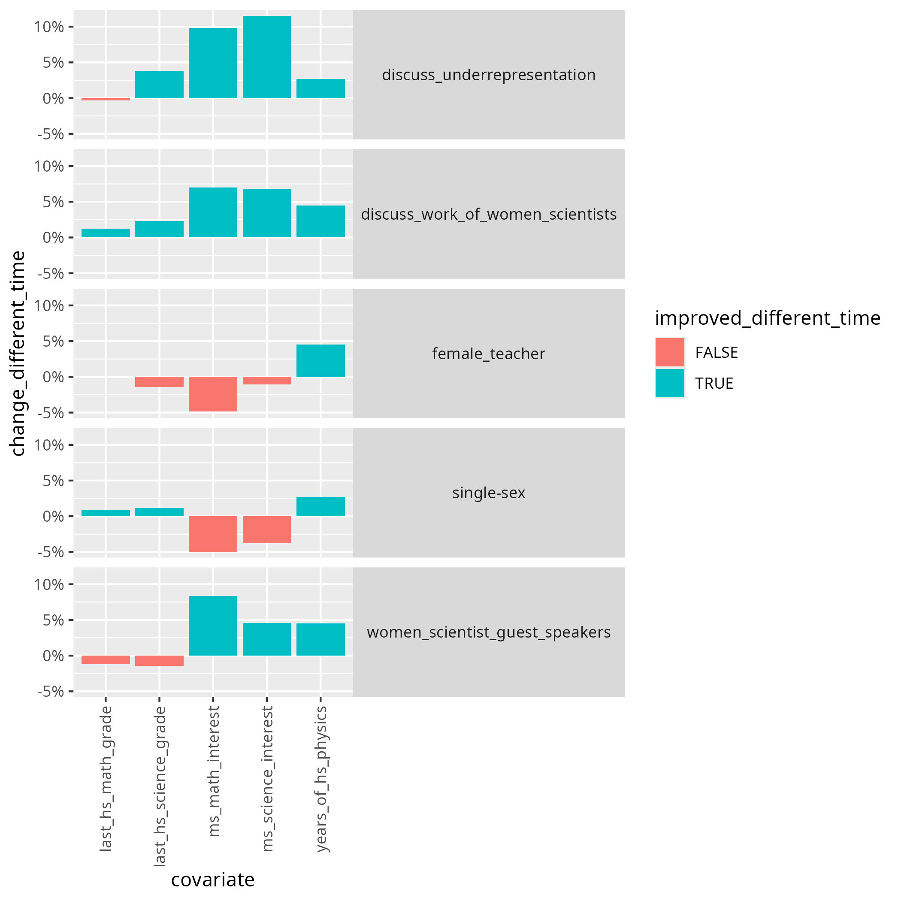
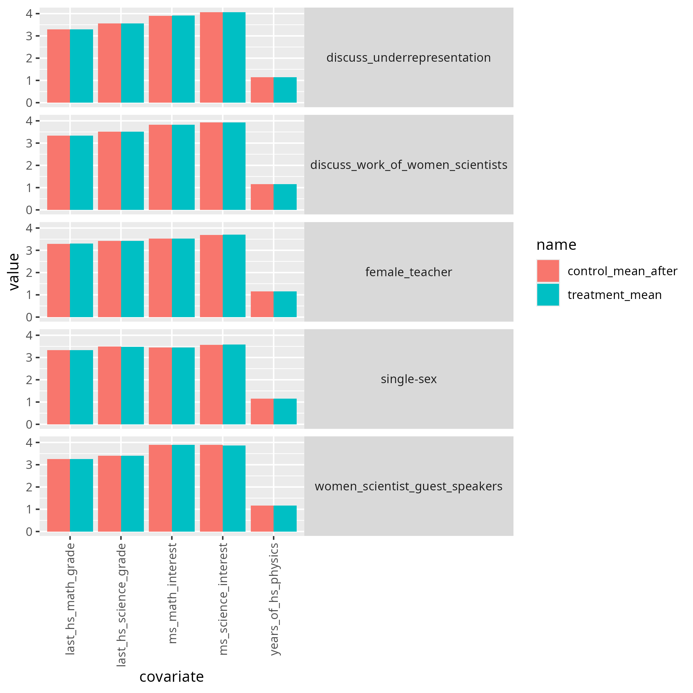

---
tags:
  - notes
  - 2025-10-30
  - McClellan
---

# 2025-10-30

- Date: 2025-10-30
- Lead discussion: Kristen Schröder
- Paper: Johnson, Angela.
  "How to design research-aligned DEI interventions in physics."
  arXiv preprint arXiv:2406.01390 (2024)
  [`https://arxiv.org/abs/2406.01390`](https://arxiv.org/abs/2406.01390)

## Notes

### Questions

- Q: What grade on a scale from 1 (worst) to 10 (best)
  would you give this paper?

???- question "My answer"

    ?

- Q: How would you praise the paper?

???- question "My answer"

    ?

- Q: How would you criticise the paper?

???- question "My answer"

    ?

- Q: How would you summarize the paper in one line?

???- question "My answer"

    ?

- Q: Should we do what is in the paper?

???- question "My answer"

    ?

- Q: How does this paper make us a better teacher?

???- question "My answer"

    ?

## My questions

- Equity: equal opportunities, e.g. providing hearing aids for the deaf.

## Extent of the problem

I hope this paper will show how big the problem is that is solved.

The paper seems ambitious by also stating that it looks for
evidence.

## How do the listed DEI interventions improve DEI?

???- question "What are these 4 DEI interventions?"

    - Light touch DEI intervention
    - DEI training: workshops
    - DEI unit
    - DEI semester-long theme

Here is my initial guess:

Intervention                |Effect of diversity?|Effect on equity?|Effect on inclusion?
----------------------------|--------------------|-----------------|--------------------
Light touch DEI intervention|?No                 |?No              |?Yes, but weird
DEI training: workshops     |?No                 |?No              |?No
DEI unit                    |?No                 |?No              |?No
DEI semester-long theme     |?No                 |?No              |?No

## 4. Outcomes

- A. Reduce implicit bias
- B. Increase participants’ awareness of their own biases/the impact of bias on others
- C. Teach participants strategies to overcome bias
- D. Increase opportunities to practice strategies to overcome bias
- E. Increase internal or external motivation to reduce bias
- F. Increase physics identity/intent to pursue a physic major or career

I think F is most important for this paper. I hope to read a number
about this.

## 4.A Implicit bias

> A. Reduce implicit bias
> While some interventions have been shown to reduce participants’ implicit biases (as measured
> on the Implicit Association Test, for example), these changes do not lead to changes in either explicit bias
> or behavior. Thus, I do not recommend reduction of implicit bias as an outcome goal unless it is
> accompanied with other goals; perhaps not even then, as it is not clear that implicit bias is in fact a
> measure of participants’ animus to other groups. There is reason to think it might be a measure instead of
> the cultural norms of their environment.

I think this is a good idea, to not care about implicit bias tests:
out of curiosity, I've taken one. This is my result:

> You were slightly faster at sorting 'Fat people' with 'Bad words' 
> and 'Thin people' with 'Good words' 
> than 'Thin people' with 'Bad words' and 'Fat people' with 'Good words'

This results does not give me any info. I felt the test was rigged.

## 4.F. Increase physics identity/intent to pursue a physic major or career

The paper refers to `[Hazari et al., 2013][42]`:

- (i) having a single-sex physics class
- (ii) having female scientist guest speakers, 
- (iii) having a female physics teacher, 
- (iv) discussing the work of female scientists
- (v) discussing the underrepresentation of women

Six point scale ('0 - Not at all likely' to '5 - Extremely likely')

discussion of underrepresentation was highly significantly
correlated with interest in a career in physical science. Discussing the work of female scientists
trended very strongly towards significance (p=.05).

Here is table 1 from `[Hazari et al., 2013][42]`:

I decided to take a look at the results visually, following the
line of reasoning of the paper:

I also wanted to see the improvements, similar to the paper,
using `(new - old) / old = (treatment - control) / control = `,
resulting in the same reported values:

However, one thing that was weird to me, is that they compare groups taken at
different points in time: the treatment group was measured after the
treatment, where the control group used was the one before the treatment.

I decided to compare with the control group after the treatment:

Here I see no difference. Let's plot the differences:

I conclude that `[Hazari et al., 2013][42]` is misleading
and proves that there is no relevant effect.

## References

- `[Hazari et al., 2013][42]`
  Z. Hazari, G. Potvin, R. M. Lock, F. Lung, G. Sonnert and P. M. Sadler,
  “Factors that Affect the Physical Science Career Interest of Female Students:
  Testing Five Common Hypotheses,” Physical
  Review Special Topics - Physics Education Research 9 (2), 020115 (2013).

- `[Johnson, 2024]` Johnson, Angela.
  "How to design research-aligned DEI interventions in physics."
  arXiv preprint arXiv:2406.01390 (2024)
  [`https://arxiv.org/abs/2406.01390`](https://arxiv.org/abs/2406.01390)

- `[Schipull, 2019][7]` 
  E. M. Schipull, X. R. Quichocho and E. W. Close, 
  ““Success Together”: Physics departmental
  practices supporting LGBTQ+ women and women of color,”
  Proceedings of the Physics Education
  Research Conference, 535-540 (2019).

