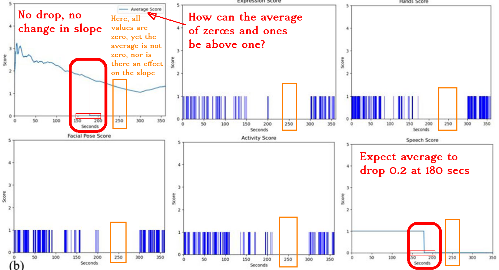

# 2024-10-16: Lockman & Schirmer, 2020

- Discussion leader: Stephan Nylinder
- Date: 2024-10-16
- Paper: Dimitriadou, Eleni, and Andreas Lanitis. "Evaluating the impact of an automated body language assessment system." Education and Information Technologies (2024): 1-31.

## Notes by Richel

First sentence already is deceptive: 'Body language is an important aspect in
educational settings, directly influencing
educators’ effectiveness in message delivery, classroom management, and student
interactions (Benzer, 2012).'. This references a paper called
'Teachers’ Opinions about the Use of Body Language', where
that ask 100 teachers
if they think body language is important.
'When asked, teachers think body language is an important aspect in
educational settings, with possible effects on influencing
educators’ effectiveness in message delivery, classroom management, and student
interactions'.

Sample size of 9

Table 5: 'Do you think the application
is useful for improving the
lecture quality?' before and after using
the tool.
The p value cannot be reproduced:

> Reproducing the p values as found in Table 5.
> Simulated disctributions did follow a normal distribution.
> We know that the data is not perfectly normally distributed.
> These simulations show that the data is skewed favorably for the test
> and/or that the test is done incorrectly: we need the data to conclude.

However, the
Normality is accepted only for the factor “Satisfaction from feedback” for the first phase
(p = 0.100) and second phase (p = 0.175).

It does not describe what a grade of, say 4.5, means: is this a
4.5 out of 7 or 4.5 out of 10?

Section 2.2, 2nd paragraph:
> Recognizing and responding to these cues can sig-
> nificantly enhance the educational experience (Miller, 2005; Κucuk 2023; Hussain
> et al., 2022). Teachers who effectively use body language create a positive and
> attractive environment (Kucuk 2023) and students showing higher levels of satisfac-
> tion for the lesson (Caswell & Neill, 2003).

Looking at the references:

- Hussain, A., Badshah Rehman, D. M. M. S., Abdul Naseer, D. S. B., & Muhammad, A. (2022). Introduction
  and development of body language and its importance in education (An Overview In The Context Of
  Contemporary And Islamic Teachings). Journal of Positive School Psychology,6(10), 4355–4362
    - 'In the paper under investigation, the introduction, evolution and necessity and importance of body language have been evaluated in the light of contemporary and Islamic teachings.':
    they use Quran as a source of wisdom
- Miller, P. W. (2005). Body language in the classroom. Techniques: Connecting Education and Careers,80(8), 28–30.
    - This paper is not available anymore, main page is <https://eric.ed.gov/?id=EJ720792>
- Kucuk, T. (2023). The power of body language in education: A study of teachers’ perceptions
    - This is a survey done on teachers
- Caswell, C., & Neill, S. (2003). Body language for competent teachers. Routledge.
    - This book can only be purchased, not downloaded from ub.uu.se, nor be found on SciHub

> Figure 3 problems

Also, in the discussion:

> Body language plays a crucial role in communication, as it can convey emotions,
engagement, and enthusiasm, which are essential for effective teaching (Tok &
Temel, 2014).

This refers to: Tok, Mehmet, and Hasan Temel. "Body language scale: Validity and reliability study/Beden dili ölçeği: Geçerlik ve güvenirlik çalışması." Eğitimde Kuram ve Uygulama 10.1 (2014): 103-122.
This study makes a 'Body language scale' with
23 indicators with a 5-point scale table. That paper
does not state how 'essential [body language is] for effective teaching'.
Instead, here is a quote:

> The education processes require effective use of communication [1].
> It has been thought [2] that the evaluation of these processes advantageously is connected
substantially with the quality of communication between the teacher and student [3] (Bolat, 1996).

- [1] No reference here
- [2] 'has been thought' is quite the qualifier
- [3] this is only about the communication quality in general

